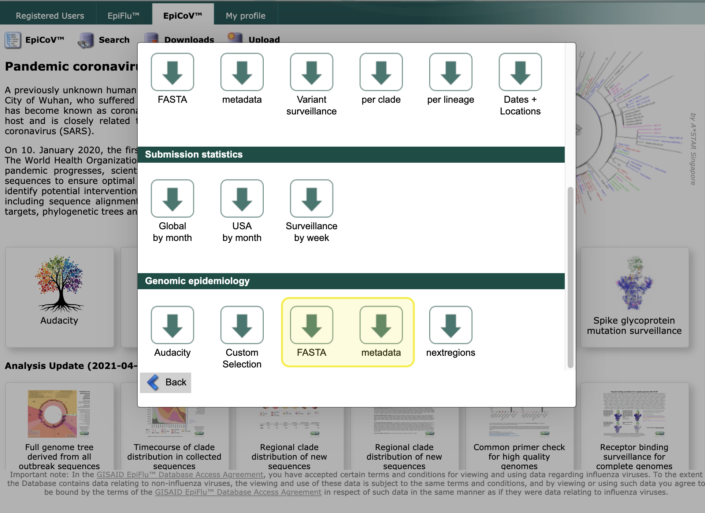

# Preparing your data
<!-- WARNING -->
<!-- Do not edit this file from within the docs.nextstrain.org repository. -->
<!-- It is fetched from another repository to be included in the docs.nextstrain.org build. -->
<!-- So, if you edit it after it is fetched into docs.nextstrain.org, your changes will be lost. -->
<!-- Instead, edit this file in its own repository and commit your changes there. -->
<!-- For more details on this (temporary) implementation, see https://github.com/nextstrain/docs.nextstrain.org#fetching-of-documents-from-other-repositories -->
<!-- This file is fetched from: https://github.com/nextstrain/ncov/blob/master/docs/data-prep.md -->
<!-- WARNING -->
<!-- WARNING -->
<!-- WARNING -->

**We've prepared an example dataset in the `data` directory. If you'd like to move ahead with this tutorial with this example dataset, you can skip this section.
If you'd like to use your own data, read on.**

To use Nextstrain to analyze your own data, you'll need to prepare two files:

1. A `fasta` file with viral genomic sequences
2. A corresponding `tsv` file with metadata describing each sequence

We've created an example dataset in the `data` directory. This consists of a fasta file with viral genomes sourced from Genbank, and a corresponding TSV with metadata describing these sequences.

### Formatting your sequence data

The first 2 lines in `data/sequences.fasta` look like this:
```
>Wuhan-Hu-1/2019
ATTAAAGGTTTATACCTTCCCAGGTAACAAACCAACCAACTTTCGATCTCTTGTAGATC.....
```
**The first line is the `strain` or `name` of the sequence.**
Names in FASTA files always start with the `>` character (this is not part of the name), and may not contain spaces or `()[]{}|#><`.
Note that "strain" here carries no biological or functional significance and should be thought of as synonymous with "sample."

The sequence itself is a **[consensus genome](https://en.wikipedia.org/wiki/Consensus_sequence#:~:text=In%20molecular%20biology%20and%20bioinformatics,position%20in%20a%20sequence%20alignment.)**.

**By default, sequences less than 27,000 bases in length or with more than 3,000 `N` (unknown) bases are omitted from the analysis.**
For a basic QC and preliminary analysis of your sequence data, you can use [clades.nextstrain.org](https://clades.nextstrain.org/).
This tool will check your sequences for excess divergence, clustered differences from the reference, and missing or ambiguous data. In addition, it will assign nextstrain clades and call mutations relative to the reference.

---

### Formatting your metadata

Nextstrain accommodates many kinds of metadata, so long as it is in a `TSV` format.
A `TSV` is a text file, where each row (line) represents a sample and each column (separated by tabs) represents a field.

>If you're unfamiliar with TSV files, don't fret; it's straightforward to export these directly from Excel, which we'll cover shortly.

Here's an example of the first few columns of the metadata for a single strain, including the header row.
_(Spacing between columns here is adjusted for clarity, and only the first 6 of 23 columns are shown)._
```
strain              virus  gisaid_epi_isl  genbank_accession   date        region   ...
NewZealand/01/2020  ncov   EPI_ISL_413490  ?                   2020-02-27  Oceania  ...
```

In total there are 23 columns of metadata for each genome; see the last section of this page for an in-depth walkthrough.

#### Required metadata

A valid metadata file must include the following fields:

| Field | Example value | Description | Formatting |
|---|---|---|---|
|`strain` or `name`| `NewZealand/01/2020` | Sample name / ID | Each header in the fasta file must exactly match a `strain` value in the metadata. Characters `()[]{}|#><` are disallowed |
|`date` | `2020-02-27`, `2020-02-XX`, `2020-XX-XX` | Date of _sampling_ | `YYYY-MM-DD`; ambiguities can be indicated with `XX`|
|`virus`|`ncov`|Pathogen name|Needs to be consistent|
|`region`|"Africa", "Asia", "Europe", "North America", "Oceania" or "South America"|Global region of _sampling_ ||

Please be aware that **our current pipeline will filter out any genomes with an unknown date - you can change this in your own pipeline.**


#### Missing metadata:

Missing data is to be expected for certain fields.
In general, **missing data is represented by an empty string or a question mark character.**
There is one important difference: if a discrete trait reconstruction (e.g. via `augur traits`) is to be run on this column, then a value of `?` will be inferred, whereas the empty string will be treated as missing data in the output. See below for how to represent uncertainty in sample collection date.


#### General formatting tips:
- **The _order_ of the fields doesn't matter**; but if you are going to join your metadata with the global collection then it's easiest to keep them in the same order!
- **Not all fields are currently used**, but this may change in the future.
- Data is **case sensitive**
- The **"geographic" columns, such as "region" and "country" will be used to plot the samples on the map**.
Adding a new value to these columns isn't a problem at all, but there are a few extra steps to take; see the [customization guide](customizing-analysis.md).
- **You can color by any of these fields in the Auspice visualization**. Which exact columns are used, and which colours are used for each value is completely customisable; see the [customization guide](customizing-visualization.md).


#### Formatting metadata in Excel
You can also create a TSV file in Excel.
However, due to issues with auto-formatting of certain fields in Excel (like dates), we don't recommend this as a first option.
If you do edit a file in Excel, open it afterwards in a text-editor to check it looks as it should!
1. Create a spreadsheet where each row is a sample, and each column is a metadata field
2. Ensure your spreadsheet meets the requirements outlined above. Pay special attention to date formats; see [this guide to date formatting in Excel](https://support.microsoft.com/en-us/office/format-a-date-the-way-you-want-8e10019e-d5d8-47a1-ba95-db95123d273e?ui=en-us&rs=en-us&ad=us).
3. Click on `File > Save as`
4. Choose `Text (Tab delimited) (*.txt)` and enter a filename ending in `.tsv`


---
## Contextualizing your data

### Background / contextual sequences
Making inferences about a sample's origin is strongly dependent on the makeup of your dataset: the model can't infer a transmission from an origin it doesn't have any (or enough) data from.

To address this, we strongly recommend adding contextual background sequences to your dataset. To make this easier, we provide a continually-updated dataset, pre-formatted for Nextstrain, through [GISAID](https://gisaid.org). To download this dataset:

1. Log into GISAID's EpiCoV site
2. Click "Downloads" to bring up a modal window
3. In this window click on "nextmeta" to download the file `nextstrain_metadata.tsv.bz2`.
This should be decompressed and saved as `data/global_metadata.tsv`.
4. Then, in this window click on "nextfasta" to download the file `nextstrain_sequences.fasta.bz2`.
This should be decompressed and saved as `data/global_sequences.fasta`.



You can concatenate these files with your own; make sure the TSV fields are in the same order.

### Subsampling

We've outlined several methods for subsampling, including builds with a focus area + genetically similar contextual sequences, in the [next section](running.md).

---

## Appendix: in-depth guide to the standard Nextstrain metadata fields
**Column 1: `strain`**

This needs to match the name of a sequence in the FASTA file exactly and must not contain characters such as spaces, or `()[]{}|#><`.
In our example we have a strain called "NewZealand/01/2020" so there should be a sequence in the FASTA file for ">NewZealand/01/2020" (sequence names in FASTA files always start with the `>` character, but this is not part of the name).

**Note that "strain" here carries no biological or functional significance** and should be thought of as synonymous with sample.

**Column 2: `virus`**

Name of the pathogen.

**Column 3: `gisaid_epi_isl`**

If this genome is shared via [GISAID](https://www.gisaid.org/) then please include the EPI ISL here. In our example this is "EPI_ISL_413490".

**Column 4: `genbank_accession`**

If this genome is shared via [GenBank](https://www.ncbi.nlm.nih.gov/genbank/) then please include the accession number here. In our example this is "?" indicating that it hasn't (yet) been deposited in GenBank. (See above for more information on how to encode missing data.)

**Column 5: `date`** (really important!)

This describes the sample collection data (_not_ sequencing date!) and must be formated according as `YYYY-MM-DD`.
Our example was collected on Feb 27, 2020 and is therefore represented as "2020-02-27".

You can specify unknown dates or month by replacing the respected values by `XX` (ex: `2013-01-XX` or `2011-XX-XX`) and completely unknown dates can be shown with `20XX-XX-XX` (which does not restrict the sequence to being in the 21st century - they could be earlier).
Please be aware that our current pipeline will filter out any genomes with an unknown date, however you can change this for your pipeline!

See [this guide](https://support.microsoft.com/en-us/office/format-a-date-the-way-you-want-8e10019e-d5d8-47a1-ba95-db95123d273e?ui=en-us&rs=en-us&ad=us) to formatting dates in Excel

**Column 6: `region`**

The region the sample was collected in -- for our example this is "Oceania".
Please use either "Africa", "Asia", "Europe", "North America", "Oceania" or "South America".
If you sequence a genome from Antartica, please get in touch!


**Column 7: `country`**

The country the sample was collected in. Our example, "NewZealand/01/2020", was collected in ....... New Zealand.
You can run `tail +2 data/metadata.tsv | cut -f 7 | sort | uniq` to see all the countries currently present in the metadata.
As of April 10, there were 64! 🌎

**Column 8: `division`**

Division currently doesn't have a precise definition and we use it differently for different regions.
For instance for samples in the USA, division is the state in which the sample was collected here. For other countries, it might be a county, region, or other administrative sub-division.
To see the divisions which are currently set for your country, you can run the following command (replace "New Zealand" with your country):
```bash
tail +2 data/metadata.tsv | cut -f 7,8 | grep "^New Zealand" | cut -f 2 | sort | uniq
```

**Column 9: `location`**

Similarly to `division`, but for a smaller geographic resolution. This data is often unavailable, and missing data here is typically represented by an empty field or the same value as `division` is used.
In our example the division is "Auckland", which conveniently (or confusingly) is both a province of New Zealand and a city.

**Column 10: `region_exposure`**

If the sample has a known travel history and infection is thought to have occured in this location, then represent this here.
In our example, which represents New Zealand's first known case, the patient had recently arrived from Iran, thus the value here is "Asia".
Specifying these travel histories helps inform the model we use to reconstruct the geographical movements of the virus.

If there is no travel history then set this to be the same value as `region`.


**Column 11: `country_exposure`**

Analogous to `region_exposure` but for `country`.
In our example, given the patient's travel history, this is set to "Iran".

**Column 12: `division_exposure`**

Analogous to `region_exposure` but for `division`. If we don't know the exposure division, we may specify the value for `country_exposure` here as well.

**Column 13: `segment`**

Unused. Typically the value "genome" is set here.

**Column 14: `length`**

Genome length (numeric value).

**Column 15: `host`**

Host from which the sample was collected.
Currently we have multiple values in the dataset, including "Human", "Canine", "Manis javanica" and "Rhinolophus affinis".

**Column 16: `age`**

Numeric age of the patient from whom the sample was collected.
We round to an integer value.
This will show up in auspice when clicking on the tip in the tree which brings up an info box.

**Column 17: `sex`**

Sex of the patient from whom the sample was collected.
This will show up in auspice when clicking on the tip in the tree which brings up an info box.

**Column 18: `originating_lab`**

Please see [GISAID](https://www.gisaid.org/help/publish-with-gisaid-references/) for more information.

**Column 19: `submitting_lab`**

Please see [GISAID](https://www.gisaid.org/help/publish-with-gisaid-references/) for more information.

**Column 20: `authors`**

Author of the genome sequence, or the paper which announced this genome.
Typically written as "LastName et al".
In our example, this is "Storey et al".
This will show up in auspice when clicking on the tip in the tree which brings up an info box.


**Column 21: `url`**

The URL, if available, pointing to the genome data.
For most SARS-CoV-2 data this is [https://www.gisaid.org](https://www.gisaid.org).

**Column 22: `title`**

The URL, if available, of the publication announcing these genomes.

**Column 23: `date_submitted`**

Date the genome was submitted to a public database (most often GISAID).
In `YYYY-MM-DD` format (see `date` for more information on this formatting).


## [Previous Section: Setup and installation](setup.md)
## [Next Section: Orientation: workflow](orientation-workflow.md)
