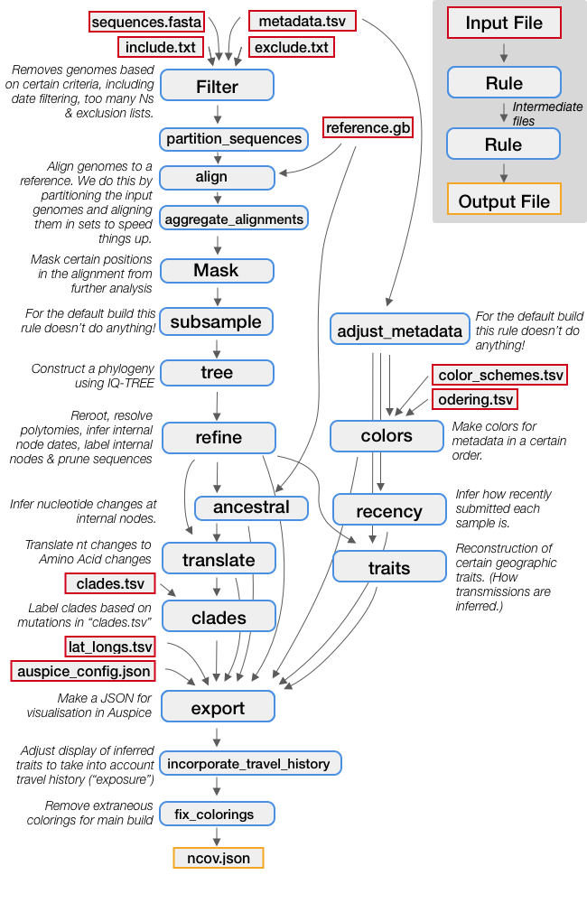

# Orientation: so, what does Nextstrain *do*?
<!-- WARNING -->
<!-- Do not edit this file from within the docs.nextstrain.org repository. -->
<!-- It is fetched from another repository to be included in the docs.nextstrain.org build. -->
<!-- So, if you edit it after it is fetched into docs.nextstrain.org, your changes will be lost. -->
<!-- Instead, edit this file in its own repository and commit your changes there. -->
<!-- For more details on this (temporary) implementation, see https://github.com/nextstrain/docs.nextstrain.org#fetching-of-documents-from-other-repositories -->
<!-- This file is fetched from: https://github.com/nextstrain/ncov/blob/master/docs/orientation-workflow.md -->
<!-- WARNING -->
<!-- WARNING -->
<!-- WARNING -->

Nextstrain has two main parts:
* **Augur performs the bioinformatic analyses** required to produce a tree, map, and other inferences from your input data.  
* The outputs of augur form the input for **Auspice, which provides the visualizations** you see on Nextstrain.org  

You can find more information about how these tools fit together [here](https://nextstrain.org/docs/getting-started/introduction). We'll come back to Auspice when we get to the [visualization](sharing.md) section.

First, let's take a look at how augur works.

## How bioinformatic analyses are managed     

At its core, augur is a collection of Python scripts, each of which handles one step in the bioinformatic analyses necessary for visualization with auspice.

As you might imagine, keeping track of the input and output files from each step individually can get very confusing, very quickly.
So, **to manage all of these steps, we use a workflow manager called snakemake**.

> _Note: there are many other workflow managers out there, such as nextflow. While we fully encourage you to use whichever workflow tools you prefer, we only provide support and maintenance for snakemake._  

Snakemake is an incredibly powerful workflow manager with many complex features. For our purposes, though, we only need to understand a few things:  

* **Each step in a workflow is called a "rule."** The inputs, outputs, and shell commands for each step/rule are defined in a `.smk` file.    
* Each rule has a number of **parameters, which are specified in a `.yaml` file**.  
* Each rule produces **output (called a "dependency") which may be used as input to other rules**.

## Overview of a Nextstrain "build" (analysis workflow)
Below is an illustration of each step in a standard Nextstrain analysis workflow.
Dependencies (output files from one step that act as input to the next) are indicated by grey arrows. Input files which must be provided are indicated with red outlines. As you can see in yellow, the final output is a JSON file for visualization in auspice.

Required input files (e.g. the sequence data generated in the [data preparation section](data-prep.md), or other files which are part of this repo) are indicated with red outlines. We'll walk through each of these in detail in the next section.

We encourage you to take a look at [`main_workflow.smk`](https://github.com/nextstrain/ncov/blob/master/workflow/snakemake_rules/main_workflow.smk) to see what each rule is doing in more detail.  

>Note: Not all of the rules included are essential, or may even be desirable for your analysis. Your build may be able to be made a lot simpler, depending on your goals.

### What's a "build?"

The components in this diagram **constitute a Nextstrain "build" -- i.e., a set of commands, parameters and input files which work together to reproducibly execute bioinformatic analyses and generate a JSON for visualization with auspice.** You can learn more about builds [here](https://nextstrain.org/docs/bioinformatics/what-is-a-build).

Builds are particularly important if you frequently want to run several different analysis workflows or datasets. For example, if you wanted to run one analysis on just your data and another analysis that incorporates background / contextual sequences, you could configure two different _builds_ (one for each of these workflows). We'll cover this in more detail in the [basic build configuration](running.md) section.

## [Previous Section: Preparing your data](data-prep.md)
## [Next Section: Orientation: which files should I touch?](orientation-files.md)
