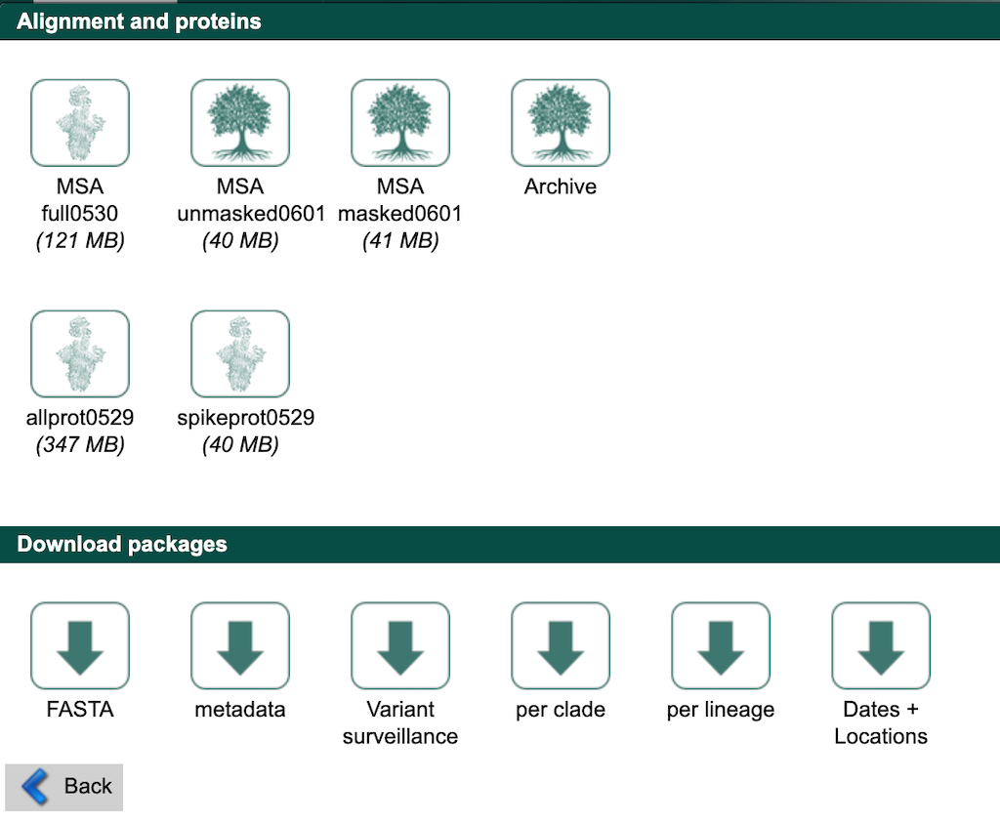

Curate data from the full GISAID database
=========================================

Some analyses require custom subsampling of the full GISAID database to most effectively understand SARS-CoV-2 evolution. For example, analyses that investigate specific variants or transmission patterns within localized outbreaks benefit from customized contextual data. These specific searches can easily exceed the 5000-record download limit from GISAID's search interface and the diversity of data available in the Nextstrain “nextregions” downloads.

The following instructions describe how to curate data for a region-specific analysis using the full GISAID sequence and metadata files. As with `the curation process described above <#curate-data-from-gisaid-search-and-downloads>`__, we describe how to select contextual data from the rest of the world to improve estimates of introductions to your region. This type of analysis also provides a path to selecting contextual data that are as genetically similar as possible to your region's data.

In this example, we will select the following subsets of GISAID data:

1. all data from Washington State in the last two months
2. a random sample of data from North America (excluding Washington) in the last two months
3. a random sample of data from outside North America in the last six months

.. contents:: Table of Contents
   :local:

Download all SARS-CoV-2 metadata and sequences from GISAID
----------------------------------------------------------

The following instructions assume you have already registered for a free GISAID account, logged into that account, and selected the “EpiCoV” link from the navigation bar, `as described above <#login-to-gisaid>`__. Select the “Downloads” link from the EpiCoV navigation bar.

.. figure:: ../../images/gisaid-epicov-navigation-bar-with-downloads.png
   :alt: GISAID EpiCoV navigation bar with “Downloads” link

   GISAID EpiCoV navigation bar with “Downloads” link

Find the “Download packages” section and select the “FASTA” button.

   GISAID download window with the “Download packages” sections

Agree to the terms and conditions and download the corresponding file (named like ``sequences_fasta_2021_06_01.tar.xz``) to the ``data/`` directory. Next, select the “metadata” button from that same “Download packages” section and download the corresponding file (named like ``metadata_tsv_2021_06_01.tar.xz``) to the ``data/`` directory.

.. warning::

   If “FASTA” or “metadata” options do not appear in the “Download packages” window, use the “Contact” link in the top-right of the GISAID website to request access to these files.

`We use these data in our official Nextstrain builds <https://github.com/nextstrain/ncov-ingest>`__. If you have sufficient computing resources, you can use these files as ``inputs`` for the workflow in a the workflow config file like the one described above. However, the workflow starts by aligning all input sequences to a reference and this alignment can take hours to complete even with multiple cores. As an alternative, we show how to select specific data from these large files prior to starting the workflow.

Prepare GISAID data for Augur
-----------------------------

Nextstrain's bioinformatics toolkit, :term:`docs.nextstrain.org:Augur`, does not support GISAID's default formatting (e.g., spaces are not allowed in sequence ids, additional metadata in the FASTA defline is unnecessary, “hCoV-19/” prefixes are not consistently used across all databases, composite “location” fields in the metadata are not tab-delimited, etc.). As a result, the workflow includes tools to prepare GISAID data for processing by Augur.

First, prepare the sequence data. This step strips prefixes from strain ids in sequence records, removes whitespace from the strain ids, removes additional metadata in the FASTA defline, and removes duplicate sequences present for the same strain id.

.. code:: bash

   python3 scripts/sanitize_sequences.py \
       --sequences data/sequences_fasta_2021_06_01.tar.xz \
       --strip-prefixes "hCoV-19/" \
       --output data/sequences_gisaid.fasta.gz

To speed up filtering steps later on, index the sequences with Augur. This command creates a tab-delimited file describing the composition of each sequence.

.. code:: bash

   augur index \
       --sequences data/sequences_gisaid.fasta.gz \
       --output data/sequence_index_gisaid.tsv.gz

Next, prepare the metadata. This step resolves duplicate records for the same strain name using GISAID's ``Accession ID`` field (keeping the record with the latest id), parses the composite ``Location`` field into ``region``, ``country``, ``division``, and ``location`` fields, renames special fields to names Augur expects, and strips prefixes from strain names to match the sequence data above.

.. code:: bash

   python3 scripts/sanitize_metadata.py \
       --metadata data/metadata_tsv_2021_06_01.tar.xz \
       --database-id-columns "Accession ID" \
       --parse-location-field Location \
       --rename-fields 'Virus name=strain' 'Accession ID=gisaid_epi_isl' 'Collection date=date' \
       --strip-prefixes "hCoV-19/" \
       --output data/metadata_gisaid.tsv.gz

Select region-specific data
---------------------------

Select data corresponding to your region of interest. In this example, we select strains from Washington State collected between April 1 and June 1, 2021. The ``--query`` argument of the ``augur filter`` command supports `any valid pandas-style queries on the metadata as a data frame <https://pandas.pydata.org/pandas-docs/stable/user_guide/indexing.html#indexing-query>`__.

.. code:: bash

   augur filter \
       --metadata data/metadata_gisaid.tsv.gz \
       --query "(country == 'USA') & (division == 'Washington')" \
       --min-date 2021-04-01 \
       --max-date 2021-06-01 \
       --exclude-ambiguous-dates-by any \
       --output-strains strains_washington.txt

The output is a text file with a list of strains that match the given filters with one name per line. As of June 1, 2021, the corresponding output contains 8,193 strains.

Select contextual data for your region of interest
--------------------------------------------------

Select a random sample of recent data from your region's continent. In this example, we will randomly sample 1,000 strains collected between April 1 and June 1, 2021 from North American data, excluding data we've already selected from Washington.

.. code:: bash

   augur filter \
       --metadata data/metadata_gisaid.tsv.gz \
       --query "(region == 'North America') & (division != 'Washington')" \
       --min-date 2021-04-01 \
       --max-date 2021-06-01 \
       --exclude-ambiguous-dates-by any \
       --subsample-max-sequences 1000 \
       --output-strains strains_north-america.txt

Select a random sample of recent data from the rest of the world. Here, we will randomly sample 1,000 strains collected between December 1, 2020 and June 1, 2021 from all continents except North America. To evenly sample all regions through time, we also group data by region, year, and month and sample evenly from these groups.

.. code:: bash

   augur filter \
       --metadata data/metadata_gisaid.tsv.gz \
       --query "region != 'North America'" \
       --min-date 2020-12-01 \
       --max-date 2021-06-01 \
       --exclude-ambiguous-dates-by any \
       --subsample-max-sequences 1000 \
       --group-by region year month \
       --output-strains strains_global.txt

Extract metadata and sequences for selected strains
---------------------------------------------------

Now that you've selected a subset of strains from the full GISAID database, extract the corresponding metadata and sequences to use as inputs for the Nextstrain workflow.

.. code:: bash

   augur filter \
       --metadata data/metadata_gisaid.tsv.gz \
       --sequence-index data/sequence_index_gisaid.tsv.gz \
       --sequences data/sequences_gisaid.fasta.gz \
       --exclude-all \
       --include strains_washington.txt strains_north-america.txt strains_global.txt \
       --output-metadata data/subsampled_metadata_gisaid.tsv.gz \
       --output-sequences data/subsampled_sequences_gisaid.fasta.gz

You can use these extracted files as inputs for the workflow.

.. code:: yaml

   # Define inputs for the workflow.
   inputs:
     - name: subsampled-gisaid
       metadata: data/subsampled_metadata_gisaid.tsv.gz
       sequences: data/subsampled_sequences_gisaid.fasta.gz
