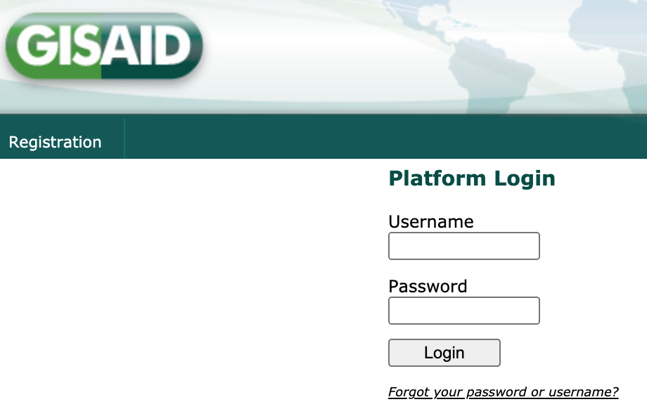
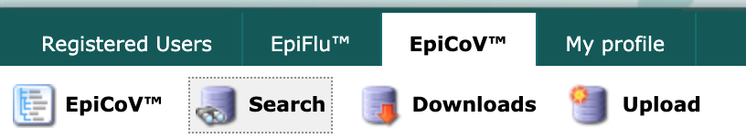
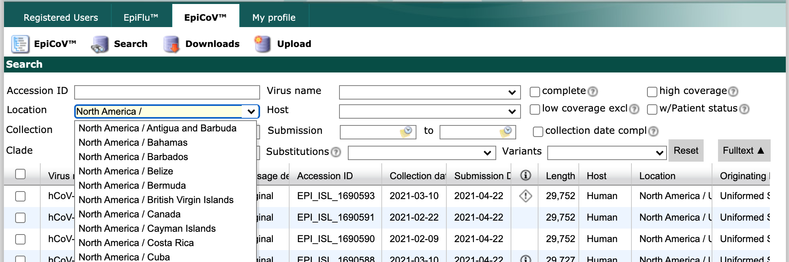
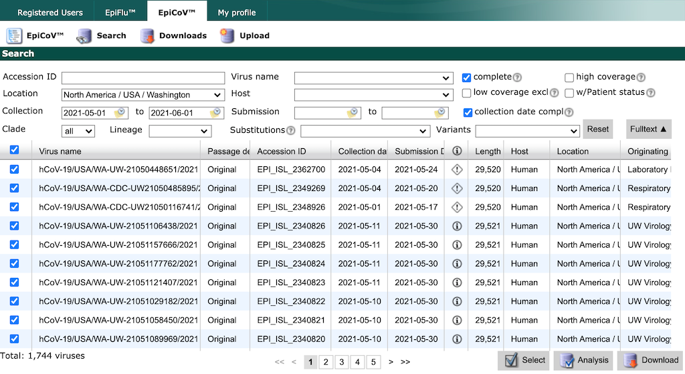
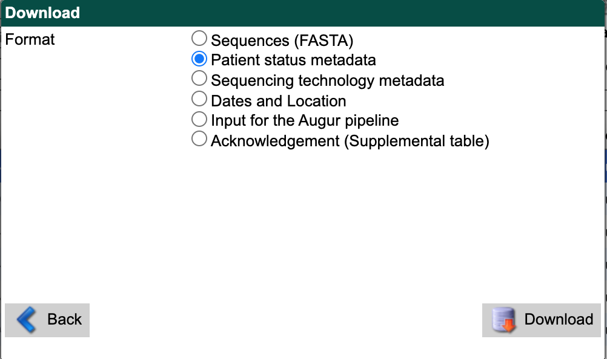
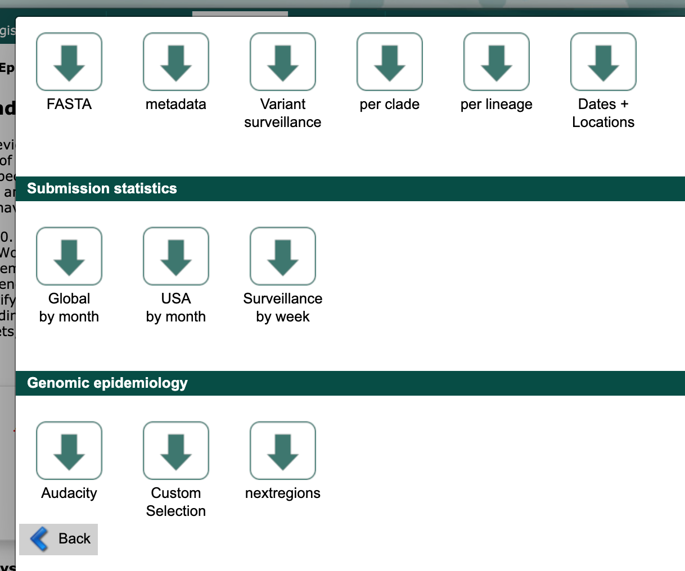
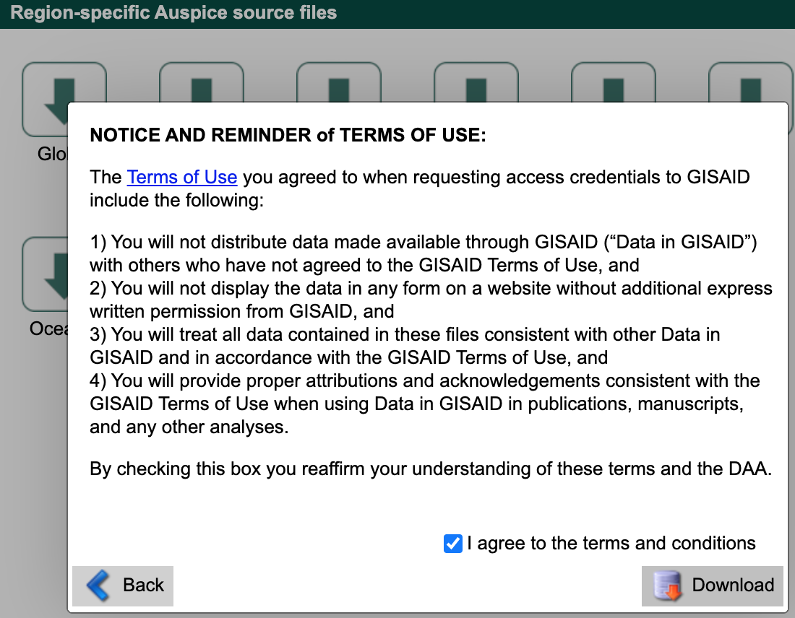

Curate data from GISAID search and downloads
============================================

The following instructions describe how to curate data for a region-specific analysis (e.g., identifying recent introductions into Washington State) using GISAID's “Search” page and curated regional data from the “Downloads” window. Inferences about a sample's origin strongly depend on the composition of your dataset. For example, discrete trait analysis models cannot infer transmission from an origin that is not present in your data. We show how to overcome this issue by adding previously curated contextual sequences from Nextstrain to your region-specific dataset.

.. contents:: Table of Contents
   :local:

Login to GISAID
---------------

Navigate to `GISAID (gisaid.org) <https://www.gisaid.org/>`__ and select the “Login” link.

   GISAID homepage with login link

Login to your GISAID account. If you do not have an account yet, register for one (it's free) by selecting the “Registration” link.

   GISAID login page with registration link

Select “EpiCoV” from the top navigation bar.

   GISAID navigation bar with “EpiCoV” link

Search for region-specific data
-------------------------------

Select “Search” from the EpiCoV navigation bar.

   GISAID EpiCoV navigation bar with “Search” link

Find the “Location” field and start typing “North America /”. As you type, the field will suggest more specific geographic scales.

   GISAID initial search interface

Finish by typing “North America / USA / Washington”. Select all strains collected between May 1 and June 1 with complete genome sequences and collection dates. Click the checkbox in the header row of the results display, to select all strains that match the search parameters.

   GISAID search results for “Washington”

.. warning::

   GISAID limits the number of records you can download at once to 5000. If you need to download more records, constrain your search results to smaller windows of time by collection date and download data in these smaller batches.

Select the “Download” button in the bottom right of the search results. There are two options to download data from GISAID, both of which we describe below.

Option 1: Download “Input for the Augur pipeline”
~~~~~~~~~~~~~~~~~~~~~~~~~~~~~~~~~~~~~~~~~~~~~~~~~

From the resulting “Download” window, select “Input for the Augur pipeline” as the download format.

.. figure:: ../../images/gisaid-search-download-window.png
   :alt: GISAID search download window showing “Input for the Augur pipeline” option

   GISAID search download window showing “Input for the Augur pipeline” option

Select the “Download” button and save the resulting file to the ``data/`` directory with a descriptive name like ``gisaid_washington.tar``. This tar archive contains compressed metadata and sequences named like ``1622567829294.metadata.tsv.xz`` and ``1622567829294.sequences.fasta.xz``, respectively.

You can use this tar file as an input for the Nextstrain workflow, as shown below. The workflow will extract the data for you. Create a new workflow config file, in the top-level of the ``ncov`` directory that defines your analysis or “builds”.

.. code:: yaml

   # Define inputs for the workflow.
   inputs:
     - name: washington
       # The workflow will detect and extract the metadata and sequences
       # from GISAID tar archives.
       metadata: data/gisaid_washington.tar
       sequences: data/gisaid_washington.tar

Next, you can move on to the heading below to get contextual data for your region of interest. Alternately, you can extract the tar file into the ``data/`` directory prior to analysis.

.. code:: bash

   tar xvf data/gisaid_washington.tar

Rename the extracted files to match the descriptive name of the original archive.

.. code:: bash

   mv data/1622567829294.metadata.tsv.xz data/gisaid_washington_metadata.tsv.xz
   mv data/1622567829294.sequences.fasta.xz data/gisaid_washington_sequences.fasta.xz

You can use these extracted files as inputs for the workflow.

.. code:: yaml

   # Define inputs for the workflow.
   inputs:
     - name: washington
       # The workflow also accepts compressed metadata and sequences
       # from GISAID.
       metadata: data/gisaid_washington_metadata.tsv.xz
       sequences: data/gisaid_washington_sequences.fasta.xz

Option 2: Download “Sequences” and “Patient status metadata”
~~~~~~~~~~~~~~~~~~~~~~~~~~~~~~~~~~~~~~~~~~~~~~~~~~~~~~~~~~~~

Alternately, you can download sequences and metadata as two separate uncompressed files. First, select “Sequences (FASTA)” as the download format. Check the box for replacing spaces with underscores. Select the “Download” button and save the resulting file to the ``data/`` directory with a descriptive name like ``gisaid_washington_sequences.fasta``.

.. figure:: ../../images/gisaid-search-download-window-sequences.png
   :alt: GISAID search download window showing “Sequences (FASTA)” option

   GISAID search download window showing “Sequences (FASTA)” option

From the search results interface, select the “Download” button in the bottom right again. Select “Patient status metadata” as the download format. Select the “Download” button and save the file to ``data/`` with a descriptive name like ``gisaid_washington_metadata.tsv``.

   GISAID search download window showing “Patient status metadata” option

You can use these files as inputs for the workflow like so.

.. code:: yaml

   # Define inputs for the workflow.
   inputs:
     - name: washington
       metadata: data/gisaid_washington_metadata.tsv
       sequences: data/gisaid_washington_sequences.fasta

Download contextual data for your region of interest
----------------------------------------------------

Next, select the “Downloads” link from the EpiCoV navigation bar.

.. figure:: ../../images/gisaid-epicov-navigation-bar-with-downloads.png
   :alt: GISAID EpiCoV navigation bar with “Downloads” link

   GISAID EpiCoV navigation bar with “Downloads” link

Scroll to the “Genomic epidemiology” section and select the “nextregions” button.

   GISAID downloads window

Select the major region that corresponds to your region-specific data above (e.g., “North America”).

.. figure:: ../../images/gisaid-nextregions-download-window.png
   :alt: GISAID “nextregions” download window

   GISAID “nextregions” download window

Agree to the terms and conditions and download the corresponding file (named like ``ncov_north-america.tar.gz``) to the ``data/`` directory.

   GISAID “nextregions” download terms and conditions

This compressed tar archive contains metadata and sequences corresponding to `a recent Nextstrain build for that region <https://nextstrain.org/sars-cov-2>`__ with names like ``ncov_north-america.tsv`` and ``ncov_north-america.fasta``, respectively. For example, the “North America” download contains data from `Nextstrain's North America build <https://nextstrain.org/ncov/north-america>`__. These regional Nextstrain builds contain data from a specific region and contextual data from all other regions in the world. By default, GISAID provides these “nextregions” data in the “Input for the Augur pipeline” format.

As with the tar archive from the search results above, you can use the “nextregions” compressed tar archives as input to the Nextstrain workflow and the workflow will extract the appropriate contents for you. For example, you could update your ``inputs`` in the workflow config file from above to include the North American data as follows.

.. code:: yaml

   # Define inputs for the workflow.
   inputs:
     - name: washington
       # The workflow will detect and extract the metadata and sequences
       # from GISAID tar archives.
       metadata: data/gisaid_washington.tar
       sequences: data/gisaid_washington.tar
     - name: north-america
       # The workflow will similarly detect and extract metadata and
       # sequences from compressed tar archives.
       metadata: data/ncov_north-america.tar.gz
       sequences: data/ncov_north-america.tar.gz

Alternately, you can extract the data from the compressed tar archive into the ``data/`` directory.

.. code:: bash

   tar zxvf data/ncov_north-america.tar.gz

You can use these extracted files as inputs for the workflow.

.. code:: yaml

   # Define inputs for the workflow.
   inputs:
     - name: washington
       # The workflow will detect and extract the metadata and sequences
       # from GISAID tar archives.
       metadata: data/gisaid_washington.tar
       sequences: data/gisaid_washington.tar
     - name: north-america
       # The workflow supports uncompressed or compressed input files.
       metadata: data/ncov_north-america.tsv
       sequences: data/ncov_north-america.fasta
