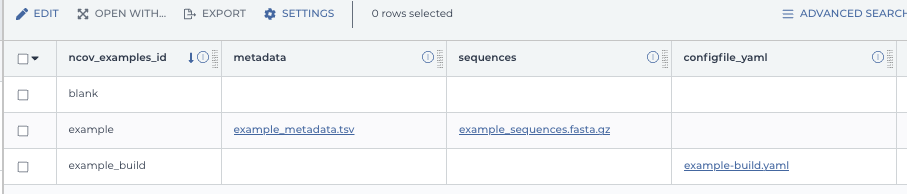

*************************
Run the workflow on Terra
*************************

Import ``ncov`` WDL workflow from Dockstore
===========================================

1. `Setup a Terra account <https://terra.bio/>`_
#. Navigate to Dockstore: `ncov:master`_
#. Top right corner, under **Launch with**, click on **Terra**
#. Under "Workflow Name" set a name, can also leave default ``ncov``, and select your **Destination Workspace** in the drop down menu.
#. Click button **IMPORT**
#. In your workspace, click on the **WORKFLOWS** tab and verify that the imported workflow is showing a card

.. _`ncov:master`: https://dockstore.org/workflows/github.com/nextstrain/ncov:master?tab=info

Upload your data files into Terra
=================================

1. Navigate to: `https://app.terra.bio/#upload`_.

#. Select your workspace
#. At the top, hit the **+** button to "create a collection"
#. Within the collection, at bottom right, click **+** button to upload file, or drag and drop files to upload them.
#. Go back to your Terra Dashboard
#. Click on the **DATA** tab
#. On the left, under **OTHER DATA**, click **Files** and there should be an "uploads/" folder shown to the right
#. Click on "uploads/" to view your collection and verify that your files have been uploaded

.. _`https://app.terra.bio/#upload`: https://app.terra.bio/#upload

Connect your data files to the WDL workflow
===========================================

1. On the **DATA** tab, click on **+** next to the **TABLES** section to create a Data Table
#. Download the "sample_template.tsv" file
#. Create a tab delimited file similar to below:

::

    entity:ncov_examples_id	metadata	sequences	configfile_yaml
    example	gs://COPY_PATH_HERE/example_metadata.tsv	gs://COPY_PATH_HERE/example_datasets/example_sequences.fasta.gz
    example_build		gs://COPY_PATH_HERE/example-build.yaml

4. Upload to **Tables** and you should get something like:

5. Navigate back to the **Workflow** tab, and click on your imported "ncov" workflow
#. Click on the radio button "Run workflow(s) with inputs defined by data table"
#. Under **Step 1**, select your root entity type **ncov_examples** from the drop down menu.
#. Click on **SELECT DATA** to select all rows
#. Most of the values will be blank but fill in the values below: 

  +-----------------+------------------+-------+----------------------+
  |Task name        | Variable         | Type  |   Attribute          |
  +=================+==================+=======+======================+
  |Nextstrain_WRKFLW|  build_name      | String| this.ncov_example.id |
  +-----------------+------------------+-------+----------------------+
  |Nextstrain_WRKFLW|  configfile_yaml | File  | this.configfile_yaml |
  +-----------------+------------------+-------+----------------------+
  |Nextstrain_WRKFLW|  metadata_tsv    | File  | this.metadata        |
  +-----------------+------------------+-------+----------------------+
  |Nextstrain_WRKFLW|  sequence_fasta  | File  | this.sequences       |
  +-----------------+------------------+-------+----------------------+

10. Click on the **OUTPUTS** tab
11. Connect your generated output back to the data table, but filling in values:

  +-----------------+-----------------+-------+----------------------+
  |Task name        | Variable	      | Type  |   Attribute          |
  +=================+=================+=======+======================+
  |Nextstrain_WRKFLW|  auspice_zip    | File  | this.auspice_zip     |
  +-----------------+-----------------+-------+----------------------+
  |Nextstrain_WRKFLW|  results_zip    | File  | this.results_zip     |
  +-----------------+-----------------+-------+----------------------+

12. Click on **Save** then click on **Run Analysis**
#. Under the tab **JOB HISTORY**, verify that your job is running.
#. When run is complete, check the **DATA** / **TABLES** / **ncov_examples** tab and download "auspice.zip" file
