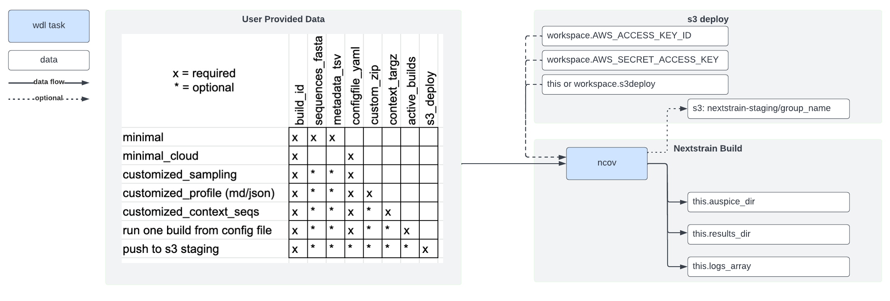

*************************
Run the workflow on Terra
*************************

We have wrapped the ncov workflow for use in Terra:

We recommend starting with the "minimal" use case (first row in "User Provided Data") with steps described below:

Import ``ncov`` WDL workflow from Dockstore
===========================================

1. `Set up a Terra account <https://terra.bio/>`_.
2. Navigate to Dockstore: `nextstrain/ncov/ncov <https://dockstore.org/workflows/github.com/nextstrain/ncov/ncov:master?tab=info>`_
#. At the top right corner, under **Launch with**, click on **Terra**. You may be prompted to log in.
#. Provide a **Workflow Name** (e.g. ``ncov``).
#. Select a **Destination Workspace** from the dropdown menu.
#. Click **IMPORT**.
#. In your workspace, click on the **WORKFLOWS** tab and verify that the imported workflow is showing a card.

Upload your data files into Terra
=================================

1. Navigate to: `https://app.terra.bio/#upload <https://app.terra.bio/#upload>`_.

#. Select your workspace
#. At the top, hit the **+** button to "create a collection"
#. Within the collection, at bottom right, click **+** button to upload file, or drag and drop files to upload them.
#. Go back to your Terra Dashboard
#. Click on the **DATA** tab
#. On the left, under **OTHER DATA**, click **Files** and there should be an "uploads/" folder shown to the right
#. Click on "uploads/" to view your collection and verify that your files have been uploaded

Connect your data files to the WDL workflow
===========================================

1. On the **DATA** tab, click on **+** next to the **TABLES** section to create a Data Table
#. Download the "sample_template.tsv" file
#. Create a tab delimited file similar to below:

::

    entity:ncov_examples_id	metadata	sequences	configfile_yaml
    blank   
    example	gs://COPY_PATH_HERE/example_metadata.tsv	gs://COPY_PATH_HERE/example_datasets/example_sequences.fasta.gz
    example_build		gs://COPY_PATH_HERE/example-build.yaml

4. Upload to **Tables** and you should get something like:

.. image:: ../images/terra-datatable.png

5. Navigate back to the **Workflow** tab, and click on your imported "ncov" workflow
#. Click on the radio button "Run workflow(s) with inputs defined by data table"
#. Under **Step 1**, select your root entity type **ncov_examples** from the drop down menu.
#. Click on **SELECT DATA** to select all rows
#. Most of the values will be blank but fill in the values below: 

  +-----------------+------------------+-------+----------------------+
  |Task name        | Variable         | Type  |   Attribute          |
  +=================+==================+=======+======================+
  |Nextstrain_WRKFLW|  build_name      | String| this.ncov_example.id |
  +-----------------+------------------+-------+----------------------+
  |Nextstrain_WRKFLW|  configfile_yaml | File  | this.configfile_yaml |
  +-----------------+------------------+-------+----------------------+
  |Nextstrain_WRKFLW|  metadata_tsv    | File  | this.metadata        |
  +-----------------+------------------+-------+----------------------+
  |Nextstrain_WRKFLW|  sequence_fasta  | File  | this.sequences       |
  +-----------------+------------------+-------+----------------------+

10. If creating a build with multiple sequence and metadata files, can upload a tarball containing the files as described in `this tutorial <https://docs.nextstrain.org/projects/ncov/en/latest/guides/data-prep/gisaid-search.html#download-contextual-data-for-your-region-of-interest>`_. Otherwise skip

  +-----------------+-----------------+-------+----------------------+
  |Task name        | Variable        | Type  |   Attribute          |
  +=================+=================+=======+======================+
  |Nextstrain_WRKFLW|  context_targz  | File  | this.context_targz   |
  +-----------------+-----------------+-------+----------------------+

11. OPTIONAL CHANGE: If you are uploading GISAID/GenBank, or very large sequence files, it is highly recommended to increase disk size.

  +-----------------+-------------------+-------+---------------------------------------------+
  |Task name        | Variable          | Type  |  Description                                |
  +=================+===================+=======+=============================================+
  |Nextstrain_WRKFLW|  disk_size        | Int   | 30 gb by default, may need to expand to 500 |
  +-----------------+-------------------+-------+---------------------------------------------+

12. OPTIONAL CHANGE: If you have a private/public nextstrain group, specify the following variables to push to an s3 site. Otherwise this step can be skipped.

  +-----------------+-----------------------+--------+--------------------------------+
  |Task name        | Variable              | Type   |  Description                   |
  +=================+=======================+========+================================+
  |Nextstrain_WRKFLW| s3deploy              | String | nextstrain provided url string |
  +-----------------+-----------------------+--------+--------------------------------+
  |Nextstrain_WRKFLW| AWS_ACCESS_KEY_ID     | String | your group access key id       |
  +-----------------+-----------------------+--------+--------------------------------+
  |Nextstrain_WRKFLW| AWS_SECRET_ACCESS_KEY | String | your group secret access key   |
  +-----------------+-----------------------+--------+--------------------------------+

13. Click on the **OUTPUTS** tab
14. Connect your generated output back to the data table, but filling in values:

  +-----------------+-----------------+-------+----------------------+
  |Task name        | Variable	      | Type  |   Attribute          |
  +=================+=================+=======+======================+
  |Nextstrain_WRKFLW|  auspice_zip    | File  | this.auspice_zip     |
  +-----------------+-----------------+-------+----------------------+
  |Nextstrain_WRKFLW|  results_zip    | File  | this.results_zip     |
  +-----------------+-----------------+-------+----------------------+

15. Click on **Save** then click on **Run Analysis**
#. Under the tab **JOB HISTORY**, verify that your job is running.
#. When run is complete, check the **DATA** / **TABLES** / **ncov_examples** tab and download "auspice.zip" file
