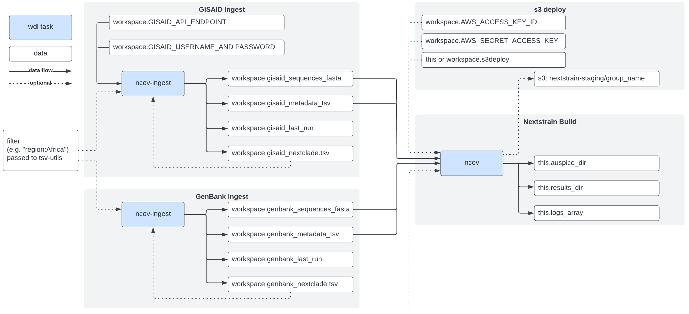

*******************************************
Ingest SARS-CoV-2 data from GISAID on Terra
*******************************************

We have provided two pipelines for importing data into Terra:

* GenBank Ingest - pull a public dataset and send them through our preprocessing scripts.
* **GISAID Ingest - pull a private dataset if a user has their own API endpoint, username, and password.**

The pipelines were mainly motivated to provide access to our data pre-processing scripts. Currently, these are focused on pulling datasets for the ncov workflow and is roughly diagrammed below:

This guide describes the **GISAID Ingest**. Importing the workflow and setting up variables should be a one-time process. The workflow can then be run multiple times to pull in new data.

As of September 26 2022, this took `11 hours to finish running with default parameters, and cost ~$44 USD <https://github.com/j23414/wdl_pathogen_build/blob/main/data/benchmarks.tsv>`_.

.. warning::
  
  To have access to GISAID Data, you will be required to have an GISAID API Endpoint by `contacting GISAID directly <https://www.gisaid.org>`_

Import the GISAID ingest wdl workflow from Dockstore
=====================================================

1. `Set up a Terra account <https://terra.bio/>`_.
2. Navigate to Dockstore: `nextstrain/ncov/gisaid_ingest <https://dockstore.org/workflows/github.com/nextstrain/ncov/gisaid_ingest:master?tab=info>`_ on Dockstore.
3. At the top right corner, under **Launch with**, click on **Terra**. You may be prompted to log in.
4. Provide a **Workflow Name** (e.g. ``gisaid_ingest``).
5. Select a **Destination Workspace** from the dropdown menu.
6. Click **IMPORT**.
7. In your workspace, click on the **WORKFLOWS** tab and verify that the imported workflow is showing a card.

.. _`nextstrain/ncov/gisaid_ingest`: https://dockstore.org/workflows/github.com/nextstrain/ncov/gisaid_ingest:master?tab=info

Create Terra Variables for GISAID API Endpoint
================================================

For GISAID data, you must have your own API key by `contacting GISAID directly <https://www.gisaid.org>`_.

1. Navigate to your workspace on Terra.
2. On the **Data** tab, from the left menu click **Workspace Data**.
3. Create and fill in values for the following workspace variables:

  +-----------------------------+----------------------------+-----------------------------------------------+
  |Key                          | Value                      | Description                                   |
  +=============================+============================+===============================================+
  |GISAID_API_ENDPOINT          |URL API endpoint value here | Provided by GISAID for your account           |
  +-----------------------------+----------------------------+-----------------------------------------------+
  |GISAID_USERNAME_AND_PASSWORD |  username:password         | Your GISAID username password for API access  |
  +-----------------------------+----------------------------+-----------------------------------------------+

Connect any workspace variables to the wdl ingest workflow
===========================================================
  
1. Navigate back to the **Workflow** tab, and click on the workflow imported to your workspace.
2. Click on the radio button **Run workflow(s) with inputs defined by data table**.
3. Under **Step 1**:

  1. Select root entity type as **ncov_examples** from the drop down menu.

4. Under **Step 2**:

  1. Click **SELECT DATA**.
  2. Select **Choose specific ncov_examples to process**.
  3. Select the 1st row in the data table. The first column should have value ``blank``. Selecting more rows will cause the workflow to run more than once.
  4. Click **OK**.

5. Most of the values will be blank but fill in the values below:

  +-----------------+-------------------------------+-------+----------------------------------------+
  |Task name        | Variable                      | Type  | Attribute                              |
  +=================+===============================+=======+========================================+
  |GISAID_INGEST    |  GISAID_API_ENDPOINT          | String| workspace.GISAID_API_ENDPOINT          |
  +-----------------+-------------------------------+-------+----------------------------------------+
  |GISAID_INGEST    |  GISAID_USERNAME_AND_PASSWORD | String| workspace.GISAID_USERNAME_AND_PASSWORD |
  +-----------------+-------------------------------+-------+----------------------------------------+

6. Click on the **OUTPUTS** tab.
7. Connect your generated output back to the workspace data, but filling in values:

  +-----------------+------------------+-------+----------------------------------+
  |Task name        | Variable	       | Type  |   Attribute                      |
  +=================+==================+=======+==================================+
  |GISAID_INGEST    |  metadata_tsv    | File  | workspace.gisaid_metadata_tsv    |
  +-----------------+------------------+-------+----------------------------------+
  |GISAID_INGEST    |  nextclade_tsv   | File  | workspace.gisaid_nextclade_tsv   |
  +-----------------+------------------+-------+----------------------------------+
  |GISAID_INGEST    |  sequences_fasta | File  | workspace.gisaid_sequences_fasta |
  +-----------------+------------------+-------+----------------------------------+

8. Click **SAVE** 
  
Run the workflow
===================

1.   **RUN ANALYSIS**.
2. Optionally enter a job description, then click **LAUNCH**.
3. The new job will appear in the **JOB HISTORY** tab. You can monitor its status by refreshing that page.
4. When run is complete, check the **DATA** / **Workspace Data** tab and use the "workspace.gisaid_sequences_fasta" and "workspace.gisaid_metadata.tsv" during normal ncov Terra runs.

