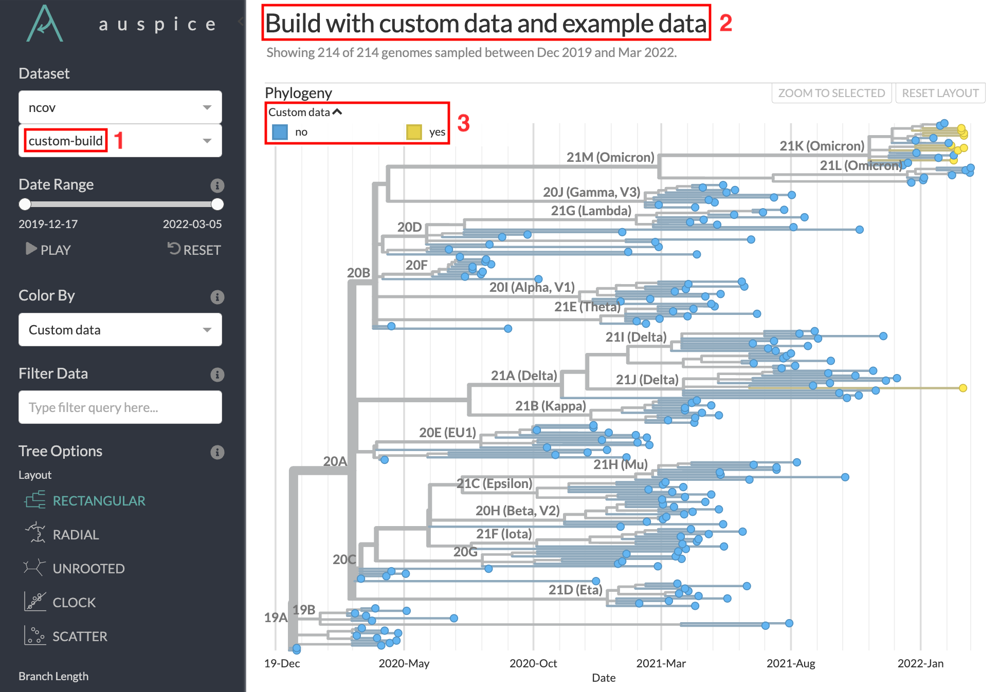

Run using custom data
=====================

This tutorial builds on :doc:`the previous tutorial <./example-data>`.
You will learn how to run the workflow with your own genomic data, using the reference data from the previous tutorial as the genetic context for these new data.
Although you will download data from GISAID for this tutorial, you can replace these data with your own local sequences and metadata in your future analyses.

.. contents:: Table of Contents
   :local:

Prerequisites
-------------

1. :doc:`example-data`. This tutorial sets up the command line environment used in the following tutorial.
2. `Register for a GISAID account <https://www.gisaid.org/registration/register/>`_, if you do not have one yet. However, registration may take a few days. Follow :doc:`alternative data preparation methods <../guides/data-prep/index>` in place of :ref:`custom-data-curate-data-from-gisaid`, if you wish to continue the following tutorial in the meantime.

Setup
-----

If you are not already there, change directory to the ``ncov`` directory:

   .. code:: text

      cd ncov

.. _custom-data-curate-data-from-gisaid:

Curate data from GISAID
-----------------------

We will retrieve 10 sequences from GISAID's EpiCoV database.

1. Navigate to `GISAID <https://www.gisaid.org/>`__ and select **Login**.

   .. image:: ../images/gisaid-homepage.png
      :width: 400
      :alt: GISAID login link

2. Login to your GISAID account.

   .. image:: ../images/gisaid-login.png
      :width: 200
      :alt: GISAID login

3. In the top left navigation bar, select **EpiCoV** then **Search**.

   .. image:: ../images/gisaid-epicov-search.png
      :width: 400
      :alt: GISAID EpiCoV Search

4. Filter to sequences that pass the following criteria:

   1. Has a complete genome
   2. Has high coverage
   3. Has an exact collection date

   .. image:: ../images/gisaid-select-sequences-10-highlighted.png
      :width: 700
      :alt: GISAID EpiCoV select first 10 sequences

5. Select the first 10 sequences.

6. Select **Download** in the bottom right of the search results.
7. Select **Input for the Augur pipeline** as the download format.

   .. image:: ../images/gisaid-augur-pipeline-download.png
      :width: 400
      :alt: GISAID EpiCoV download as Input for the Augur pipeline

   .. note::

      You may see different download options, but it is fine as long as **Input for the Augur pipeline** is available.

8. Select **Download**.
9. Download/move the ``.tar`` file into the ``ncov/data/`` directory.
10. Extract by opening the downloaded ``.tar`` file in your file explorer. It contains a folder prefixed with ``gisaid_auspice_input_hcov-19_`` containing two files: one ending with ``.metadata.tsv`` and another with ``.sequences.fasta``.
11. Rename the files as ``custom.metadata.tsv`` and ``custom.sequences.fasta``.
12. Move the files up to the ``ncov/data/`` directory.
13. Delete the empty ``gisaid_auspice_input_hcov-19_``-prefixed folder and the ``.tar`` file if it is still there.

.. hint::

   Read :doc:`the full data prep guide <../guides/data-prep/index>` for other ways to curate custom data.

Run the workflow
----------------

From within the ``ncov/`` directory, run the ``ncov`` workflow using a pre-written ``--configfile``:

.. code:: text

   nextstrain build . --configfile ncov-tutorial/custom-data.yaml

Break down the command
~~~~~~~~~~~~~~~~~~~~~~

The workflow can take several minutes to run. While it is running, you can investigate the contents of ``custom-data.yaml`` (comments excluded):

.. code-block:: yaml

   inputs:
     - name: reference_data
       metadata: https://data.nextstrain.org/files/ncov/open/reference/metadata.tsv.xz
       sequences: https://data.nextstrain.org/files/ncov/open/reference/sequences.fasta.xz
     - name: custom_data
       metadata: data/custom.metadata.tsv
       sequences: data/custom.sequences.fasta

   refine:
     root: "Wuhan-Hu-1/2019"

   builds:
     custom-build:
       title: "Build with custom data and example data"
       subsampling_scheme: all
       auspice_config: ncov-tutorial/auspice-config-custom-data.json

This is the same as the previous file, with some additions:

1. A second input for the custom data, referencing the metadata and sequences files downloaded from GISAID.
2. A ``builds`` section that defines one output :term:`docs.nextstrain.org:dataset` using:

   1. A custom name ``custom-build``, which will be used to create the dataset filename, in this case ``auspice/ncov_custom-build.json``.
   2. A custom title ``Build with custom data and example data``, which will be shown when you visualize the dataset in Auspice.
   3. :ref:`A pre-defined subsampling scheme <configuration-subsampling>` ``all``, that tells the workflow to skip subsampling and use all input data.
   4. An Auspice config file, ``ncov-tutorial/auspice-config-custom-data.json``, that defines parameters for how Auspice should display the dataset produced by the workflow. It has the following contents:

      .. code-block:: json

         {
           "colorings": [
             {
               "key": "custom_data",
               "title": "Custom data",
               "type": "categorical"
             }
           ],
           "display_defaults": {
             "color_by": "custom_data"
           }
         }

      This JSON tells Auspice to:

      1. Create a new coloring ``custom_data`` that reflects a special metadata column generated by the ncov workflow. When there is more than one input, each data input produces a new final metadata column with categorical values ``yes`` or ``no`` representing whether the sequence was from the input.
      2. Set the default Color By as the new ``custom_data`` coloring.

   .. note ::

      **Build** is a widely used term with various meanings. In the context of the ncov workflow, the ``builds:`` section defines output :term:`datasets <docs.nextstrain.org:dataset>` to be generated by the workflow (i.e. "build" a dataset).

Visualize the results
---------------------

Run this command to start the :term:`docs.nextstrain.org:Auspice` server, providing ``auspice/`` as the directory containing output dataset files:

.. code:: text

   nextstrain view auspice/

Navigate to http://127.0.0.1:4000/ncov/custom-build. The resulting :term:`docs.nextstrain.org:dataset` should have similar phylogeny to the previous dataset, with additional sequences:

1. The custom dataset name ``custom-build`` can be seen in the dataset selector, as well as the dataset URL.
2. The custom dataset title can be seen at the top of the page.
3. The custom coloring is used by default. You can see which sequences are from the custom data added in this tutorial.

   .. note::

      You may not see all 10 custom sequences - some can be filtered out due to quality checks built into the ncov workflow.
