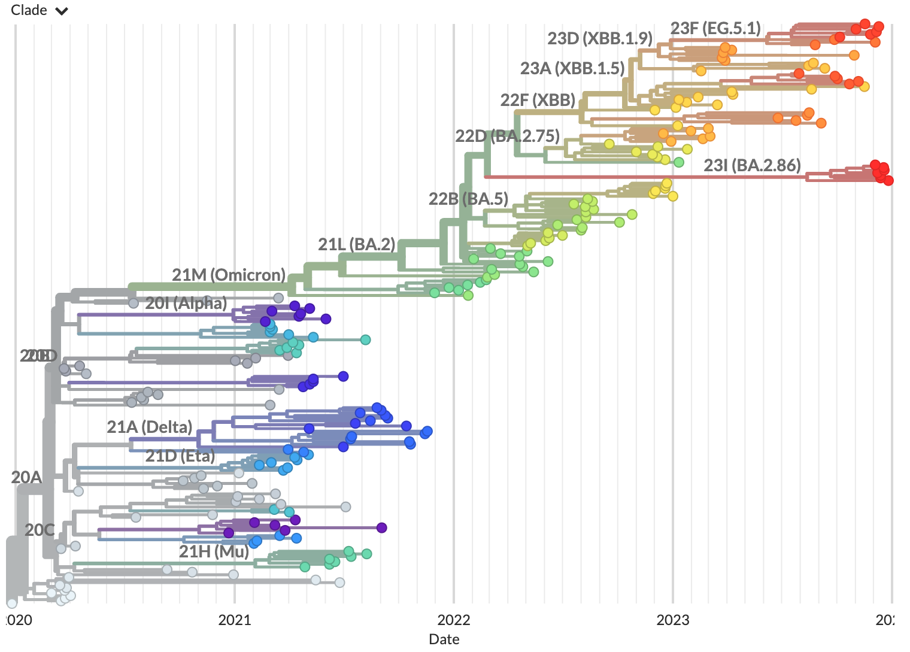

Run using example data
======================

This first tutorial introduces our SARS-CoV-2 workflow.
You will run the workflow using a small set of reference data that we provide.
Subsequent tutorials present more complex scenarios that build on this approach.

.. contents:: Table of Contents
   :local:

Prerequisites
-------------

1. :doc:`setup`. These instructions will install all of the software you need to complete this tutorial and others.

Setup
-----

1. Activate the ``nextstrain`` conda environment:

   .. code:: text

      conda activate nextstrain

2. Change directory to the ``ncov`` directory:

   .. code:: text

      cd ncov

3. Download the example tutorial repository into a new subdirectory of ``ncov/`` called ``ncov-tutorial/``:

   .. code:: text

      git clone https://github.com/nextstrain/ncov-tutorial

Run the workflow
----------------

From within the ``ncov/`` directory, run the workflow using a :term:`configuration file <config file>` provided in the tutorial directory:

.. code:: text

   nextstrain build . --configfile ncov-tutorial/example-data.yaml

Break down the command
~~~~~~~~~~~~~~~~~~~~~~

The workflow can take several minutes to run. While it is running, you can learn about the parts of this command:

- ``nextstrain build .``
   - This tells the :term:`docs.nextstrain.org:Nextstrain CLI` to :term:`build <docs.nextstrain.org:build (verb)>` the workflow from ``.``, the current directory. All subsequent command-line parameters are passed to the workflow manager, Snakemake.
- ``--configfile ncov-tutorial/example-data.yaml``
   - ``--configfile`` is another Snakemake parameter used to configure the ncov workflow.
   - ``ncov-tutorial/example-data.yaml`` is a configuration file that provides custom workflow configuration including inputs and outputs. The contents of this file with comments excluded are:

      .. code-block:: yaml

         inputs:
           - name: reference_data
             metadata: https://data.nextstrain.org/files/ncov/open/reference/metadata.tsv.xz
             sequences: https://data.nextstrain.org/files/ncov/open/reference/sequences.fasta.xz

         refine:
           root: "Wuhan-Hu-1/2019"

      The ``inputs`` entry provides the workflow with one input named ``reference_data``. The metadata and sequence files refer to a sample of approximately 300 sequences maintained by the Nextstrain team that represent all Nextstrain clades annotated for SARS-CoV-2. The workflow downloads these files directly from the associated URLs. :doc:`See the complete list of SARS-CoV-2 datasets we provide through data.nextstrain.org <../reference/remote_inputs>`.

      The ``refine`` entry specifies the root sequence for the example GenBank data.

      For more information, :doc:`see the workflow configuration file reference <../reference/workflow-config-file>`.

The workflow output produces a new directory ``auspice/`` containing a file ``ncov_default-build.json``, which will be visualized in the following section. The workflow also produces intermediate files in a new ``results/`` directory.

Visualize the results
---------------------

Run this command to start the :term:`docs.nextstrain.org:Auspice` server, providing ``auspice/`` as the directory containing output dataset files:

.. code:: text

   nextstrain view auspice/

Navigate to http://127.0.0.1:4000/ncov/default-build. The resulting :term:`docs.nextstrain.org:dataset` should show a phylogeny of ~200 sequences:

To stop the server, press :kbd:`Control-C` on your keyboard.

.. note::

   You can also view the results by dragging the dataset files all at once onto `auspice.us <https://auspice.us>`__:

   - ``auspice/ncov_default-build.json``
   - ``auspice/ncov_default-build_root-sequence.json``
   - ``auspice/ncov_default-build_tip-frequencies.json``
