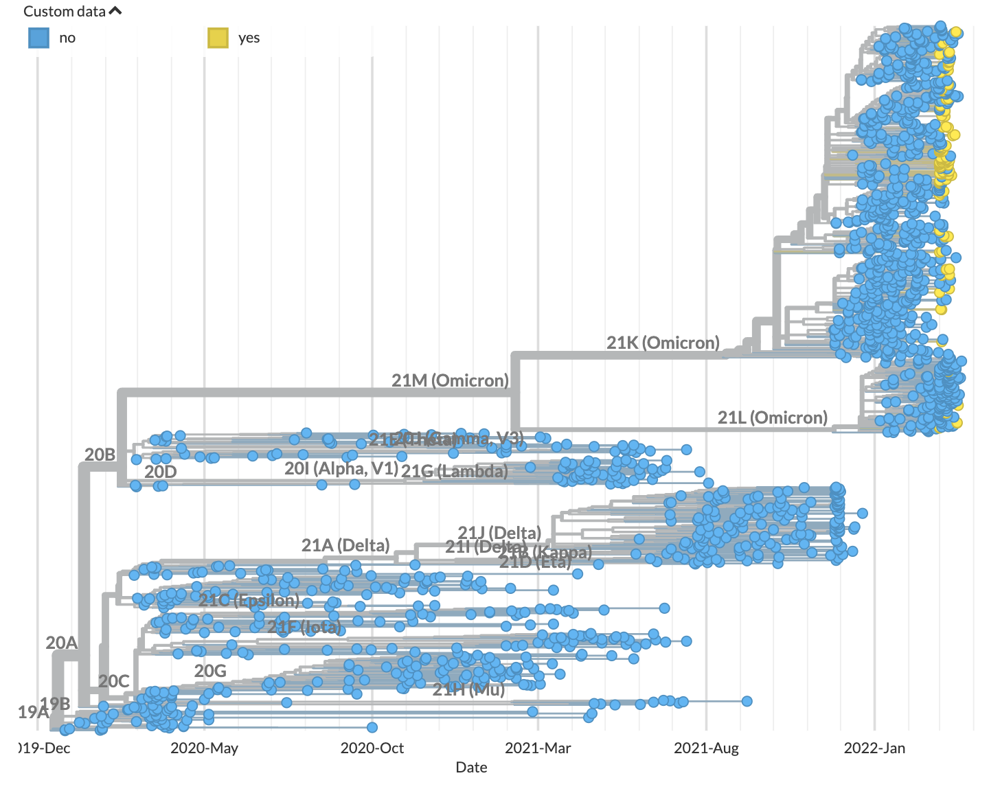

Run using a genomic surveillance configuration
==============================================

:doc:`In the previous tutorial <./custom-data>`, you learned how to analyze a small set of GISAID ("custom") data in the context of a small set of reference data.
For genomic surveillance applications, you will often **focus** your analysis on a set of data specific to your question of interest.
For example, an analysis of SARS-CoV-2 circulation in a specific geographic area requires a focal set of sequences and metadata from that area.

In this tutorial, you will learn to define and analyze a focal set of data from a geographic division in the United States using a global genetic context.
You will also learn how to define a genetic context that prioritizes sequences that are genetically similar to your focal set.

.. contents:: Table of Contents
   :local:

Prerequisites
-------------

1. :doc:`custom-data`. This tutorial introduces concepts expanded by the following tutorial.
2. `Register for a GISAID account <https://www.gisaid.org/registration/register/>`_, if you do not have one yet. However, registration may take a few days. Follow :doc:`alternative data preparation methods <../guides/data-prep/index>` in place of :ref:`genomic-surveillance-curate-data-from-gisaid`, if you wish to continue the following tutorial in the meantime.

Setup
-----

If you are not already there, change directory to the ``ncov`` directory:

   .. code:: text

      cd ncov

.. _genomic-surveillance-curate-data-from-gisaid:

Curate data from GISAID
-----------------------

We will download a focal set of Idaho sequences from GISAID's EpiCoV database.

1. Navigate to `GISAID <https://www.gisaid.org/>`__, **Login**, and go to **EpiCoV** > **Search**.

   .. image:: ../images/gisaid-epicov-search.png
      :width: 400
      :alt: GISAID EpiCoV Search

.. |last-month| timedelta::
   :weeks: -4

.. |today| date::

2. Filter to sequences that pass the following criteria:

   1. From Idaho, USA
   2. Collected within the last month (e.g. |last-month| to |today|)
   3. Has a complete genome
   4. Has an exact collection date

   .. figure:: ../images/gisaid-select-sequences-idaho-highlighted.png
      :width: 700
      :alt: GISAID EpiCoV filter and select sequences

      Example of GISAID filters using collection date between 2022-03-01 and 2022-04-01

   .. note::

      If your selection has more than 200 sequences, adjust the minimum date until it has 200 sequences or less. This ensures the tutorial does not take too long to run.

3. Select the topmost checkbox in the first column to select all sequences that match the filters.
4. Select **Download** > **Input for the Augur pipeline** > **Download**.
5. Download/move the ``.tar`` file into the ``ncov/data/`` directory.
6. Extract by opening the downloaded ``.tar`` file in your file explorer. It contains a folder prefixed with ``gisaid_auspice_input_hcov-19_`` containing two files: one ending with ``.metadata.tsv`` and another with ``.sequences.fasta``.
7.  Rename the files as ``idaho.metadata.tsv`` and ``idaho.sequences.fasta``.
8.  Move the files up to the ``ncov/data/`` directory.
9. Delete the empty ``gisaid_auspice_input_hcov-19_``-prefixed folder and the ``.tar`` file if it is still there.

Run the workflow
----------------

From within the ``ncov/`` directory, run the ``ncov`` workflow using a pre-written ``--configfile``:

.. code:: text

   nextstrain build . --configfile ncov-tutorial/genomic-surveillance.yaml

Break down the command
~~~~~~~~~~~~~~~~~~~~~~

The workflow can take several minutes to run. While it is running, you can investigate the contents of ``genomic-surveillance.yaml`` (comments excluded):

.. code-block:: yaml

   inputs:
     - name: reference_data
       metadata: https://data.nextstrain.org/files/ncov/open/reference/metadata.tsv.xz
       aligned: https://data.nextstrain.org/files/ncov/open/reference/aligned.fasta.xz
     - name: custom_data
       metadata: data/idaho.metadata.tsv
       sequences: data/idaho.sequences.fasta
     - name: background_data
       metadata: https://data.nextstrain.org/files/ncov/open/north-america/metadata.tsv.xz
       aligned: https://data.nextstrain.org/files/ncov/open/north-america/aligned.fasta.xz

   refine:
     root: "Wuhan-Hu-1/2019"

   builds:
     idaho:
       title: "Idaho-specific genomic surveillance build"
       subsampling_scheme: idaho_scheme
       auspice_config: ncov-tutorial/auspice-config-custom-data.json

   subsampling:
     idaho_scheme:
       custom_sample:
         query: --query "(custom_data == 'yes')"
         max_sequences: 50
       usa_context:
         query: --query "(custom_data != 'yes') & (country == 'USA')"
         max_sequences: 10
         group_by: division year month
         priorities:
           type: proximity
           focus: custom_sample
       global_context:
         query: --query "(custom_data != 'yes')"
         max_sequences: 10
         priorities:
           type: proximity
           focus: custom_sample

This configuration file is similar to the previous file. Differences are outlined below, broken down per configuration section.

inputs
******

1. The file paths in the second input are changed to ``idaho.metadata.tsv`` and ``idaho.sequences.fasta``.
2. There is an additional input ``background_data`` for a regional North America dataset built by the Nextstrain team, for additional context.

builds
******

The output dataset is renamed ``idaho``, representative of the new custom data in the second input.

1. The title is updated.
2. There is a new entry ``subsampling_scheme: idaho_scheme``. This is described in the following section.

subsampling
***********

This is a new section that provides a subsampling scheme ``idaho_scheme`` consisting of three subsamples. Without this, the output dataset would use all the provided data, which in this case is thousands of sequences that are often disproportionally representative of the underlying population.

1. ``custom_sample``

   - This selects at most 50 sequences from the ``custom_data`` input.

2. ``usa_context``

   - This selects at most 10 sequences from the USA from the ``background_data`` and ``reference_data`` inputs.
   - Sequences are subsampled evenly across all combinations of ``division``, ``year``, ``month``, with sequences genetically similar to ``custom_sample`` prioritized over other sequences.

3. ``global_context``

   - This selects at most 10 sequences outside the USA from the ``background_data`` and ``reference_data`` inputs.
   - As with the ``usa_context`` above, this rule prioritizes sequences for the global context that are genetically similar to sequences in the ``custom_sample``.

Visualize the results
---------------------

Run this command to start the :term:`docs.nextstrain.org:Auspice` server, providing ``auspice/`` as the directory containing output dataset files:

.. code:: text

   nextstrain view auspice/

Navigate to http://127.0.0.1:4000/ncov/idaho. The resulting :term:`docs.nextstrain.org:dataset` should show the recent Idaho sequences against a backdrop of historical sequences:

