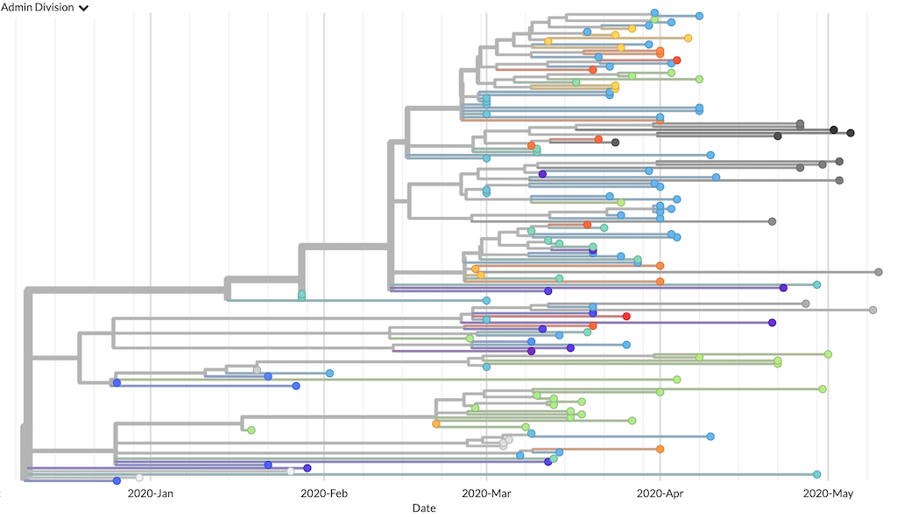

Setup and installation
======================

The following steps will prepare you to run complete analyses of SARS-CoV-2 data by installing required software and running a simple example workflow.

1. Install Nextstrain components
--------------------------------

Follow instructions to install Nextstrain components :doc:`here <docs.nextstrain.org:install>`.

.. note::

   If using the :term:`native runtime <docs.nextstrain.org:runtime>`, install these additional packages necessary to run the ncov workflow. Make sure the correct conda environment is activated.

   .. code:: bash

      mamba install -c conda-forge -c bioconda epiweeks nextclade nextalign pangolin pangolearn

2. Download the ncov workflow
-----------------------------

Download the workflow
~~~~~~~~~~~~~~~~~~~~~

Use Git to download a copy of the ncov repository containing the workflow and this tutorial.

.. code:: bash

   git clone https://github.com/nextstrain/ncov.git
   cd ncov

Alternately, `download a compressed copy of the ncov repository <https://github.com/nextstrain/ncov/archive/refs/heads/master.zip>`__ called ``ncov-master.zip``. Open this file to decompress it and create a directory called ``ncov-master/`` with the contents of the workflow in it. Navigate to this directory from the command line.

Update the workflow
~~~~~~~~~~~~~~~~~~~

We update the official workflow regularly with:

-  `curated metadata including latitudes/longitudes, clade annotations, and low quality sequences <https://github.com/nextstrain/ncov/commits/master>`__
-  bug fixes
-  `new features <../reference/change_log>`__

Update your local copy of the workflow, to benefit from these changes.

.. code:: bash

   # Download and apply changes from the Nextstrain team.
   # This only works if there is no conflict with your local repository.
   git pull --ff-only origin master

   # OR:

   # Alternately, download and apply changes from the Nextstrain team
   # and then replay your local changes on top of those incoming changes.
   git pull --rebase origin master

Alternately, download a specific version of the workflow that you know works for you. We create new `releases of the workflow <https://github.com/nextstrain/ncov/releases/>`__ any time we introduce breaking changes, so you can choose when to update based on `what has changed <../reference/change_log>`__.

.. code:: bash

   # Download version 7 (v7) of the workflow.
   curl -OL https://github.com/nextstrain/ncov/archive/refs/tags/v7.zip

   # Uncompress the workflow.
   unzip v7.zip

   # Change into the workflow's directory.
   cd ncov-7/

3. Run a basic analysis with example data
-----------------------------------------

Run a basic workflow with example data, to confirm that your :term:`Nextstrain runtime <docs.nextstrain.org:runtime>` is properly configured.

.. code:: bash

   nextstrain build . --cores 4 \
     --configfile ./my_profiles/getting_started/builds.yaml

The ``nextstrain build`` command runs a :term:`pathogen workflow <docs.nextstrain.org:workflow>` defined using Snakemake. Since our ``Snakefile`` is in the current directory, we specify the directory as ``.``. All other arguments pass through to Snakemake.

The ``getting_started`` build produces a minimal global phylogeny for visualization in :term:`docs.nextstrain.org:Auspice`. This workflow should complete in about 5 minutes on a MacBook Pro (2.7 GHz Intel Core i5) with four cores.

4. Visualize the phylogeny for example data
-------------------------------------------

`Open auspice.us <https://auspice.us>`__ in your browser. Drag and drop the :term:`JSON file <docs.nextstrain.org:JSONs>` ``auspice/ncov_global.json`` anywhere on the landing page, to visualize the resulting phylogeny. The resulting phylogeny should look something like this:

   Phylogenetic tree from the “getting started” build as visualized in Auspice
