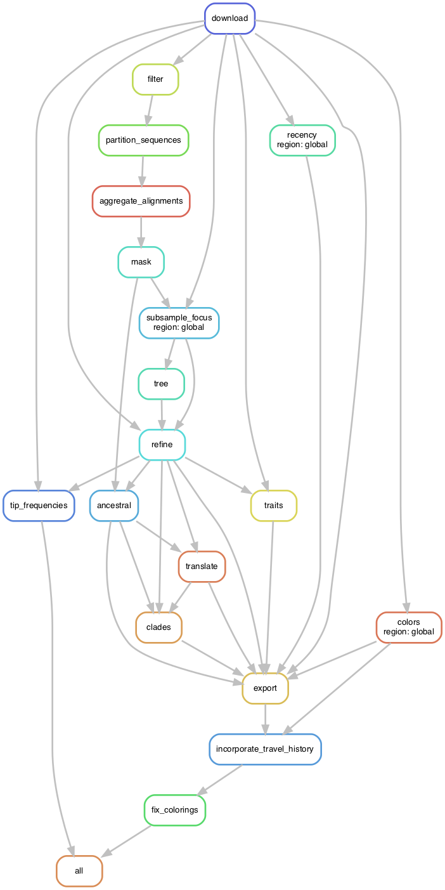
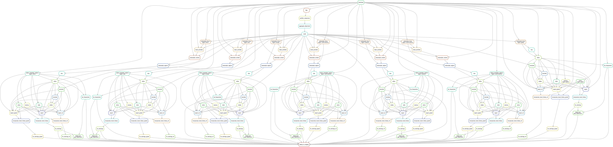

# Workflow structure

## Directory structure

The following outlines the directory structure of the ncov workflow and describes the purpose of specific directories and files.

  - `README.md` : links to secondary documentation
  - `Snakefile`: entry point for all snakemake commands, validates configuration files, includes specific rules
  - `auspice/`: auspice JSONs used for visualization locally or on nextstrain.org (examples shown below)
      - `ncov_global.json`: global build tree and metadata
      - `ncov_global_tip-frequencies.json`: global build tip frequencies
      - `ncov_global_2020-04-30.json`: dated global build JSON for Nextstrain team
      - `ncov_global_gisaid.json`: GISAID-specific JSON for Nextstrain team
      - `ncov_global_zh.json`: Chinese translation for global build JSON for Nextstrain team
      - `ncov_africa.json`: Africa build tree and metadata
  - `config/`: files used to configure workflow
      - `config.yaml`: primary configuration file, change workflow settings like filtering or subsampling thresholds here. These are modified by specific profiles below.
  - `data/`: data needed to start running a build, either downloaded from GISAID for general users or from S3 for the Nextstrain team
      - `metadata.tsv`: tab-delimited description of strain attributes
      - `sequences.fasta`: genomic sequences of strains with sequence ids matching `strain` in the metadata
  - `docs/`: specific documentation by use case
      - `metadata.md`: how metadata is structured
      - `running.md`: how to run your own builds
      - `workflow_structure.md`: this document
  - `envs/`: conda environment files used by rules
      - `nextstrain.yaml`: base Nextstrain environment needed to run workflow with the `--use-conda` flag
      - `experimental_features.yaml`: an putative example environment with experimental features that are not ready for production yet
  - `example_data/`: minimal data required to test out the default ncov build
  - `figures/`: images used in documentation and narratives
  - `logs/`: log files containing standard output and error messages from commands run by most rules
  - `narratives/`: dated situation reports based on dated build JSONs
  - `profiles/`: [Snakemake profile configuration](https://snakemake.readthedocs.io/en/stable/executing/cli.html#profiles) for users who are familiar enough with Snakemake to override default command line arguments
      - `default/`
          - `config.yaml`: a simple profile with reasonable defaults
      - `nextstrain/`
          - `config.yaml`: a profile with preferred arguments for the Nextstrain team and definition of the Nextstrain-specific configuration file
          - `builds.yaml`: additional configuration for Nextstrain team that defines all regions to build. These settings get merged with primary config/config.yaml settings.
  - `results/`: all intermediate results from the workflow go here (examples below)
      - `filtered.fasta`: sequences that pass quality control filters
      - `aligned.fasta`: multiple sequence alignment (MSA)
      - `masked.fasta`: masked MSA used by all subsequent builds
      - `region/`: region-specific results are nested by region
          - `global/`: example layout for global build, all regions follow parallel file organization
              - `subsample_focus.fasta`: subsampled MSA used for tree building
              - `tree_raw.nwk`: initial tree built by augur tree from MSA
              - `tree.nwk`: time tree built by augur refine from initial tree and MSA
          - `asia/`: another example region
              - `subsample_focus.fasta`: subsampled MSA of sequences representing this region
              - `subsample_context.fasta`: subsampled MSA of sequences representing other regions to provide context to this region's sequences
              - `subsampled_alignment.fasta`: combined MSA of focus and context sequences for this region and used for tree building
              - `tree_raw.nwk`: initial tree built by augur tree from MSA
              - `tree.nwk`: time tree built by augur refine from initial tree and MSA
  - `rules/`: specific workflow rules organized by function
      - `builds.smk`: rules for auspice JSONs from sequences, the bulk of build logic runs from top to bottom as written in this file
      - `nextstrain_exports.smk`: rules for Nextstrain custom auspice exports
  - `schemas/`: schema files used to validate configuration files
      - `config.schema.yaml`: structural requirements for primary configuration file (e.g., required fields and types, etc.)
  - `scripts/`: custom programs used by the workflow (examples below)
      - `add_priorities_to_meta.py`: an example script used to add priority information to the metadata TSV

## Workflow steps

When you run the default workflow, Snakemake builds the following directed acyclic graph (DAG).

```
snakemake --dag --forceall | dot -Tpng > figures/default_dag.png
```

<a href="../figures/default_dag.png"></a>

When you run the Nextstrain-specific workflow, Snakemake builds the following more complicated DAG.
This DAG represents multiple regional builds with a final rule that deploys auspice JSONs to an S3 bucket.

```
snakemake --dag --forceall --profile profiles/nextstrain deploy_to_staging | dot -Tpng > figures/nextstrain_dag.png
```

<a href="../figures/nextstrain_dag.png"></a>
